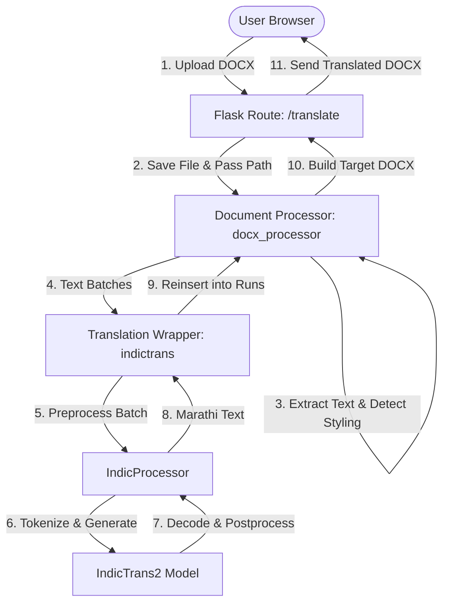

# DocTranslate 🌐📄

**DocTranslate** is a deployable web application designed to translate English `.docx` documents to Marathi (`मराठी`) while preserving layout formatting, font styles, tables, and document structures. It runs locally or on a production server using the high-accuracy **IndicTrans2** neural machine translation model.

---

## 1. Project Overview
DocTranslate serves as a tool for document translation. It extracts text from Microsoft Word documents, translates it server-side using IndicTrans2, and rebuilds the document with formatting (bold, italic, underline, font name, font size, color, alignments) mapped back onto the translated Marathi text.

---

## 2. Features
- **Strict Format Preservation**: Preserves bold, italic, underline, font family, font size, text color, paragraph alignment, and table layouts during translation.
- **Whole-Sentence Context**: Translates complete paragraphs/sentences to maintain grammatical correctness in Marathi (Subject-Object-Verb) instead of word-by-word translation.
- **GPU & CPU Acceleration**: Automatically utilizes CUDA acceleration if available, with a safe, optimized fallback to CPU.
- **Memory Optimization**: Loads the heavy IndicTrans2 model once during server startup and processes texts in safe batches to prevent memory limits.
- **Modern User Interface**: Simple, responsive drag-and-drop web dashboard.
- **Security-First**: Restricts uploads to `.docx` only, limits file sizes, and handles temporary files safely with auto-cleanup hooks.

---

## 3. Architecture

The application is structured into clear, decoupled layers:



- **API Layer (`backend/app.py`)**: Defines routes (`/translate`, `/health`, `/test-translation`) and handles file uploads, validation, temporary workspaces, and static hosting.
- **Document Processing (`backend/document/docx_processor.py`)**: Parses DOCX structure, extracts translatable text, manages layout styles, wraps formatted texts in markup tags, and maps translations back into the final document structure.
- **Translation Layer (`backend/translation/indictrans.py`)**: Manages model loading (tokenizer, model, processor) once at startup, handles CUDA/CPU dispatching, and processes translation requests using internal batching.

---

## 4. Local Setup
Ensure you have Python 3.11+ installed on your system.

### Step 1: Clone or Copy the Repository
Navigate to the root of the `DocTranslate` project folder.

### Step 2: Set Up Virtual Environment
Create and activate a virtual environment:
```powershell
python -m venv .venv
# On Windows:
.venv\Scripts\activate
# On Linux/macOS:
source .venv/bin/activate
```

---

## 5. Environment Setup
Install the dependencies from the requirements file.

```bash
# On Windows (with active virtual environment):
pip install -r requirements.txt
```

If you are running on a CPU-only local environment and want to save download bandwidth, install the CPU version of PyTorch first:
```bash
pip install torch --index-url https://download.pytorch.org/whl/cpu
pip install -r requirements.txt
```

---

## 6. How IndicTrans2 Works in the Project
The application relies on AI4Bharat's `indictrans2-en-indic-dist-200M` model. The pipeline operates as follows:
1. **Pre-loading**: The model is loaded once into server memory at application startup.
2. **Text Tagging**: Runs inside paragraphs with distinct formatting are wrapped in lightweight formatting tags (e.g. `Welcome to <b>our college</b>`).
3. **Preprocessing**: The `IndicProcessor` formats the sentences using `src_lang="eng_Latn"` and `tgt_lang="mar_Deva"`.
4. **Model Inference**: Sentences are tokenized, processed using beam search (num_beams=5), and decoded back to target tokens.
5. **Postprocessing**: The decoded tokens are processed by `IndicProcessor` to clean up spacing and Devanagari punctuation.
6. **Reconstruction**: The formatting tags are parsed and mapped back onto individual document runs, re-applying original styles.

---

## 7. How to Run the Backend
Launch the backend Flask application:

**On Windows:**
```powershell
$env:PYTHONIOENCODING='utf-8'
python backend/app.py
```

**On Linux/macOS:**
```bash
export PYTHONIOENCODING='utf-8'
python backend/app.py
```

You will see the model loading log at startup:
```
[DocTranslate] Starting backend and pre-loading model...
[DocTranslate] Loading IndicTrans2...
[DocTranslate] Model loaded successfully
 * Running on http://127.0.0.1:5000
```

---

## 8. How to Run the Frontend
No separate command or server is needed! The frontend is served directly as static files by the Flask backend application.
Once the backend starts, navigate your browser to:
[http://127.0.0.1:5000](http://127.0.0.1:5000)

---

## 9. How to Test Translation

### Test 1: Standalone Model Execution
To test if the IndicTrans2 translation engine is loaded and executing correctly on your CPU/GPU, run:
```bash
python tests/test_translation_standalone.py
```
This prints the Devanagari translation of `"Welcome to our college."` directly to the console.

### Test 2: Document Processing Integration
To test the complete document extraction, translation, reconstruction, and formatting preservation pipeline:
```bash
python tests/test_docx_translation.py
```
This creates a sample file `tests/sample.docx`, translates it, saves the output at `tests/sample_translated.docx`, and outputs styling preservation reports.

---

## 10. Deployment Instructions

### Required Server Specifications
Due to the memory footprint of PyTorch and the IndicTrans2 transformer model, the target server must meet these minimum specifications:
- **RAM**: Minimum **4 GB** (8 GB recommended). A 512MB or 1GB RAM instance (e.g. free tier Render/Heroku/AWS EC2 micro) will fail with Out-of-Memory (OOM) errors during startup.
- **Compute**: Minimum **2 vCPUs** if running on CPU. A CUDA-enabled GPU (e.g. NVIDIA T4, L4, or K80) is highly recommended for low latency in production.
- **Storage**: Minimum **5 GB** free disk space to store PyTorch, dependencies, and cached Hugging Face model weights.

### Deployment Method 1: Docker (Recommended)
We provide a standard `Dockerfile` in the root directory. To build and run the application container:

1. Build the Docker image:
   ```bash
   docker build -t doctranslate:latest .
   ```
2. Run the container:
   ```bash
   docker run -d -p 5000:5000 -v doctranslate_cache:/root/.cache doctranslate:latest
   ```
   *(Mapping the cache volume `/root/.cache` ensures Hugging Face doesn't need to re-download the 200M model files on every container restart.)*

### Deployment Method 2: VPS Deployment (AWS EC2, DigitalOcean, GCP)
1. Provision an instance (e.g. AWS EC2 `t3.medium` or a GPU-accelerated `g4dn.xlarge`).
2. Clone the repository.
3. Install system dependencies:
   ```bash
   sudo apt-get update && sudo apt-get install -y python3-pip python3-venv git build-essential
   ```
4. Create a virtual environment, install requirements, and run the server using a production-ready WSGI server like `gunicorn`:
   ```bash
   python3 -m venv .venv
   source .venv/bin/activate
   pip install gunicorn
   pip install -r requirements.txt
   gunicorn --workers 1 --timeout 120 --bind 0.0.0.0:5000 backend.app:app
   ```

---

## 11. Known Limitations
- **Word Order Re-alignment**: Because English and Marathi use different sentence structures (SVO vs. SOV), styled words may change position in the translated sentence. While formatting tags are mapped back to their corresponding translated words, extremely complex runs might experience slight formatting shifts.
- **Document Support**: Only Microsoft Word documents (`.docx`) are supported. Older `.doc` formats, PDFs, or slides are outside the MVP scope.
- **Single-Language Pair**: DocTranslate is optimized strictly for English-to-Marathi translation for this mini-project.
- **Processing Time on CPU**: When running on a CPU-only server, translating a large document with dozens of paragraphs can take 10 to 30 seconds due to sequential transformer inference.
